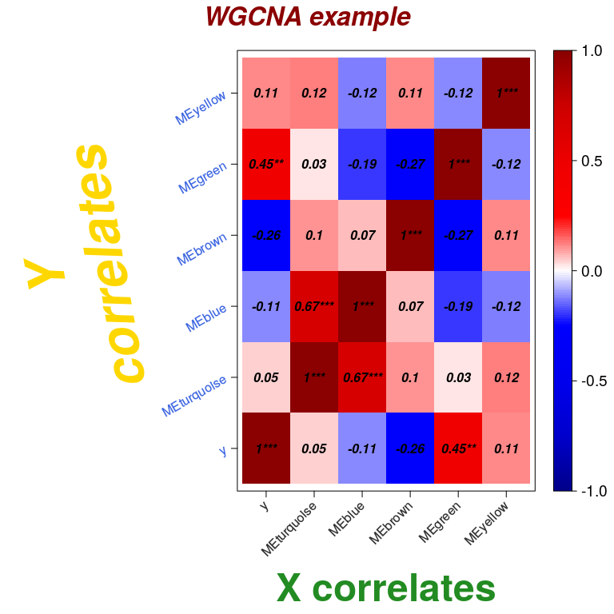
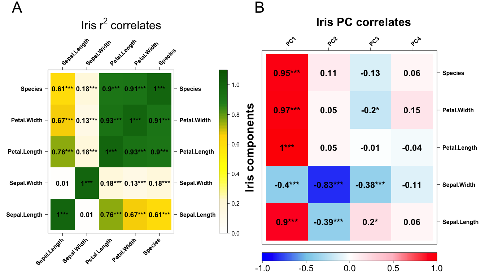
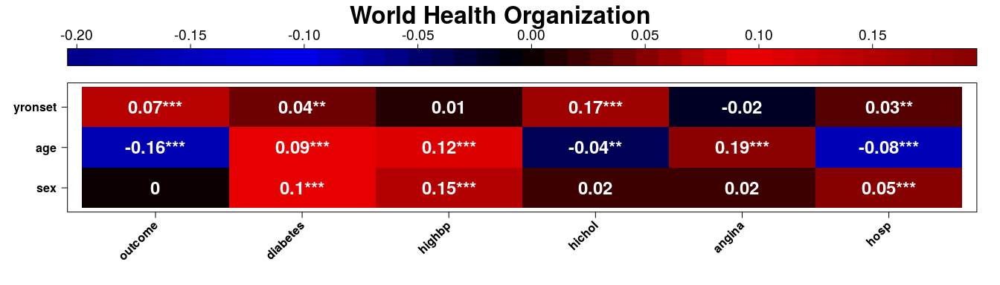

Visualise correlation results and test significancies of these
================
Kevin Blighe
2019-01-29

-   [Example CorLevelPlot plots](#example-corlevelplot-plots)
-   [Example 1: WGCNA (weighted gene co-expression network analysis) simulated data:](#example-1-wgcna-weighted-gene-co-expression-network-analysis-simulated-data)
-   [Example 2: Iris dataset principal components analysis:](#example-2-iris-dataset-principal-components-analysis)
-   [Example 3: World Health Organization (WHO) MONICA data:](#example-3-world-health-organization-who-monica-data)
-   [Acknowledgments](#acknowledgments)
-   [Session info](#session-info)
-   [References](#references)

CorLevelPlot provides a quick and colourful way to visualise statistically significant correlations between any combination of categorical and continuous variables. Moreover, the statistical significancies of these correlations are also provided.

Example CorLevelPlot plots
--------------------------

Install and load CorLevelPlot:

``` r
    devtools::install_github("kevinblighe/CorLevelPlot")
```

``` r
    library(CorLevelPlot)
```

Example 1: WGCNA (weighted gene co-expression network analysis) simulated data:
-------------------------------------------------------------------------------

The following code taken from [Tutorial for the WGCNA package for R - 1. Simulation of expression and trait data](https://labs.genetics.ucla.edu/horvath/CoexpressionNetwork/Rpackages/WGCNA/Tutorials/Simulated-01-dataSimulation.pdf)

``` r
    # simulate trait-to-eigengene data
    no.obs <- 50
    ESturquoise <- 0; ESbrown <- -0.6; ESgreen <- 0.6; ESyellow <- 0
    ESvector <- c(ESturquoise, ESbrown, ESgreen, ESyellow)
    nGenes1 <- 3000
    simulateProportions1 <- c(0.2, 0.15, 0.08, 0.06, 0.04)
    set.seed(1)
    MEgreen <- rnorm(no.obs)
    scaledy <- MEgreen * ESgreen + sqrt(1 - ESgreen ^ 2) * rnorm(no.obs)
    y <- ifelse( scaledy > median(scaledy), 2, 1)
    MEturquoise <- ESturquoise * scaledy + sqrt(1 - ESturquoise ^ 2) * rnorm(no.obs)
    MEblue <- 0.6 * MEturquoise + sqrt(1 - 0.6 ^ 2) * rnorm(no.obs)
    MEbrown <- ESbrown * scaledy + sqrt(1 - ESbrown ^ 2) * rnorm(no.obs)
    MEyellow <- ESyellow * scaledy + sqrt(1 - ESyellow ^ 2) * rnorm(no.obs)
    ModuleEigengeneNetwork1 <- data.frame(y, MEturquoise, MEblue, MEbrown, MEgreen, MEyellow)

    CorLevelPlot(data = ModuleEigengeneNetwork1,
        x = c("y", "MEturquoise", "MEblue", "MEbrown", "MEgreen", "MEyellow"),
        y = c("y", "MEturquoise", "MEblue", "MEbrown", "MEgreen", "MEyellow"),
        titleX = "X correlates",
        cexTitleX = 3.0,
        rotTitleX = 0,
        colTitleX = "forestgreen",
        fontTitleX = 2,
        titleY = "Y\ncorrelates",
        cexTitleY = 4.0,
        rotTitleY = 100,
        colTitleY = "gold",
        fontTitleY = 4,
        cexLabX = 1.0,
        rotLabX = 45,
        colLabX = "grey20",
        fontLabX = 1,
        cexLabY = 1.0,
        rotLabY = 30,
        colLabY = "royalblue",
        fontLabY = 1,
        posLab = "bottomleft",
        col = c("blue4", "blue3", "blue2", "blue1", "white", "red1", "red2", "red3", "red4"),
        posColKey = "right",
        cexLabColKey = 1.2,
        cexCorval = 1.0,
        fontCorval = 4,
        main = "WGCNA example",
        scale = FALSE,
        cexMain = 2,
        rotMain = 360,
        colMain = "red4",
        fontMain = 4,
        corFUN = "pearson",
        corUSE = "pairwise.complete.obs",
        signifSymbols = c("***", "**", "*", ""),
        signifCutpoints = c(0, 0.001, 0.01, 0.05, 1),
        colFrame = "white",
        plotRsquared = FALSE)
```



Example 2: Iris dataset principal components analysis:
------------------------------------------------------

``` r

    library(datasets)
    data(iris)

    # order the categories in the 'Species' column
    # CorLevelPlot will conver these to 1, 2, 3, ...
    iris$Species <- as.numeric(factor(iris$Species, levels=c("setosa", "versicolor", "virginica")))

    i <- CorLevelPlot(data = iris,
        x = c("Sepal.Length", "Sepal.Width", "Petal.Length", "Petal.Width", "Species"),
        y = c("Sepal.Length", "Sepal.Width", "Petal.Length", "Petal.Width", "Species"),
        col = c("white", "cornsilk1", "yellow", "gold", "forestgreen", "darkgreen"),
        cexCorval = 1.2,
        fontCorval = 2,
        posLab = "all",
        rotLabX = 45,
        scale = TRUE,
        main = bquote(Iris~r^2~correlates),
        plotRsquared = TRUE)

    pca <- stats::prcomp(iris[,c("Sepal.Length", "Sepal.Width", "Petal.Length", "Petal.Width")])
    df <- data.frame(pca$x, iris)

    ii <- CorLevelPlot(data = df,
        x = c("PC1", "PC2", "PC3", "PC4"),
        y = c("Sepal.Length", "Sepal.Width", "Petal.Length", "Petal.Width", "Species"),
        cexTitleX = 2.0,
        rotTitleX = 0,
        fontTitleX = 2,
        titleY = "Iris components",
        cexTitleY = 2.0,
        rotTitleY = 90,
        fontTitleY = 2,
        posLab = "topright",
        col = c("blue1", "skyblue", "white", "pink", "red1"),
        posColKey = "bottom",
        cexLabColKey = 1.5,
        cexCorval = 1.5,
        fontCorval = 2,
        rotLabX = 45,
        scale = TRUE,
        main = "Iris PC correlates",
        colFrame = "white",
        plotRsquared = FALSE)

    require(rasterVis)
    require(gridExtra)
    require(grid)

    grid.arrange(
        arrangeGrob(i,
            top = textGrob("A",
            x = unit(0.05,"npc"),
            y = unit(0.9,"npc"),
            just = c("left","top"),
            gp = gpar(fontsize=32))),
        arrangeGrob(ii,
            top = textGrob("B",
            x = unit(0.05,"npc"),
            y = unit(0.9,"npc"),
            just = c("left","top"),
            gp = gpar(fontsize=32))),
        ncol = 2)
```



Example 3: World Health Organization (WHO) MONICA data:
-------------------------------------------------------

``` r

    library(DAAG)
    data(monica)

    # order the categorical variables
    monica$outcome <- as.numeric(factor(monica$outcome, levels=c("dead", "live")))

    monica$diabetes[monica$diabetes=="nk"] <- NA
    monica$diabetes <- as.numeric(factor(monica$diabetes, levels=c("n", "y")))

    monica$hichol[monica$hichol=="nk"] <- NA
    monica$hichol <- as.numeric(factor(monica$hichol, levels=c("n", "y")))

    monica$stroke[monica$stroke=="nk"] <- NA
    monica$stroke <- as.numeric(factor(monica$stroke, levels=c("n", "y")))

    monica$sex <- as.numeric(factor(monica$sex, levels=c("m", "f")))

    monica$yronset <- as.numeric(factor(monica$yronset, levels=c("85","86","87","88","89","90","91","92","93")))

    monica$highbp[monica$highbp=="nk"] <- NA
    monica$highbp <- as.numeric(factor(monica$highbp, levels=c("n", "y")))

    monica$angina[monica$angina=="nk"] <- NA
    monica$angina <- as.numeric(factor(monica$angina, levels=c("n", "y")))

    monica$hosp <- as.numeric(factor(monica$hosp, levels=c("n", "y")))

    CorLevelPlot(data = monica,
        x = c("outcome", "diabetes", "highbp", "hichol", "angina", "hosp"),
        y = c("sex", "age", "yronset"),
        col = c("darkblue", "blue2", "black", "red2", "darkred"),
        cexCorval = 1.5,
        colCorval = "white",
        fontCorval = 2,
        posLab = "bottomleft",
        rotLabX = 45,
        posColKey = "top",
        cexLabColKey = 1.2,
        scale = TRUE,
        main = "World Health Organization",
        colFrame = "white",
        plotRsquared = FALSE)
```




Session info
------------

``` r
sessionInfo()
```

    ## R version 3.5.2 (2018-12-20)
    ## Platform: x86_64-pc-linux-gnu (64-bit)
    ## Running under: Ubuntu 16.04.5 LTS
    ## 
    ## Matrix products: default
    ## BLAS: /usr/lib/atlas-base/atlas/libblas.so.3.0
    ## LAPACK: /usr/lib/atlas-base/atlas/liblapack.so.3.0
    ## 
    ## locale:
    ##  [1] LC_CTYPE=pt_BR.UTF-8       LC_NUMERIC=C              
    ##  [3] LC_TIME=en_GB.UTF-8        LC_COLLATE=pt_BR.UTF-8    
    ##  [5] LC_MONETARY=en_GB.UTF-8    LC_MESSAGES=pt_BR.UTF-8   
    ##  [7] LC_PAPER=en_GB.UTF-8       LC_NAME=C                 
    ##  [9] LC_ADDRESS=C               LC_TELEPHONE=C            
    ## [11] LC_MEASUREMENT=en_GB.UTF-8 LC_IDENTIFICATION=C       
    ## 
    ## attached base packages:
    ## [1] grid      stats     graphics  grDevices utils     datasets  methods  
    ## [8] base     
    ## 
    ## other attached packages:
    ##  [1] DAAG_1.22            gridExtra_2.3        rasterVis_0.45      
    ##  [4] latticeExtra_0.6-28  RColorBrewer_1.1-2   lattice_0.20-38     
    ##  [7] raster_2.8-4         sp_1.3-1             BiocInstaller_1.32.1
    ## [10] CorLevelPlot_0.99.0  knitr_1.21          
    ## 
    ## loaded via a namespace (and not attached):
    ##  [1] Rcpp_1.0.0        compiler_3.5.2    highr_0.7        
    ##  [4] prettyunits_1.0.2 remotes_2.0.2     tools_3.5.2      
    ##  [7] digest_0.6.18     pkgbuild_1.0.2    pkgload_1.0.2    
    ## [10] gtable_0.2.0      viridisLite_0.3.0 evaluate_0.12    
    ## [13] memoise_1.1.0     rlang_0.3.1       cli_1.0.1        
    ## [16] parallel_3.5.2    curl_3.3          yaml_2.2.0       
    ## [19] hexbin_1.27.2     xfun_0.4          withr_2.1.2      
    ## [22] stringr_1.3.1     desc_1.2.0        fs_1.2.6         
    ## [25] devtools_2.0.1    rprojroot_1.3-2   glue_1.3.0       
    ## [28] R6_2.3.0          processx_3.2.1    rmarkdown_1.11   
    ## [31] sessioninfo_1.1.1 callr_3.1.1       magrittr_1.5     
    ## [34] codetools_0.2-16  backports_1.1.3   ps_1.3.0         
    ## [37] htmltools_0.3.6   usethis_1.4.0     assertthat_0.2.0 
    ## [40] stringi_1.2.4     crayon_1.3.4      zoo_1.8-4

References
----------

(Blighe 2018)

Blighe, Kevin. 2018. “CorLevelPlot: Visualise correlation results and test significancies of these.” <https://github.com/kevinblighe>.
